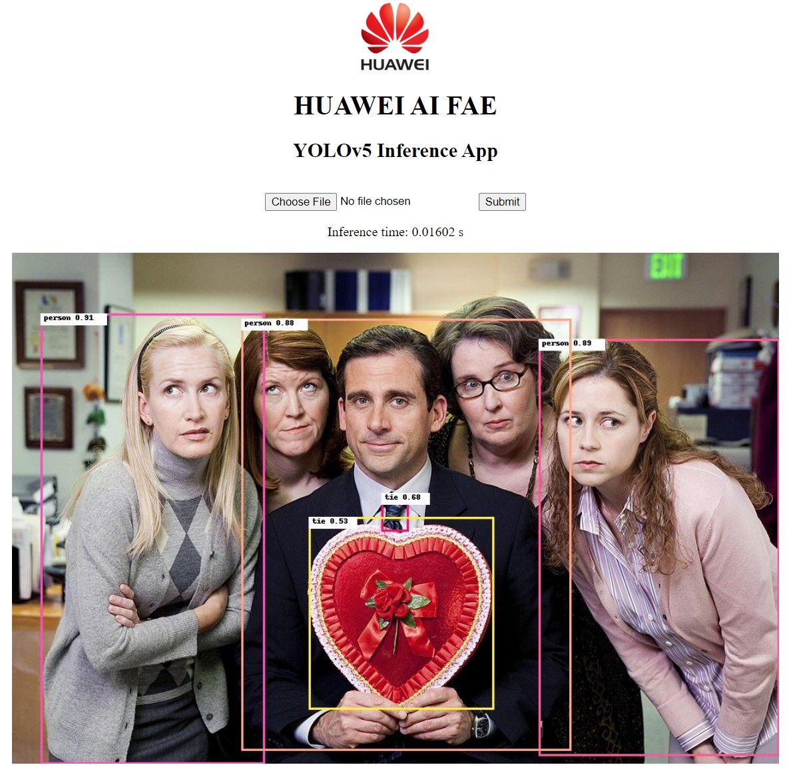

# YOLOv5 Inference Rest-API

This application does inference on **npu** devices using Yolov5 model.

</br>



</br>

## Getting started

Download appropriate **YOLOv5 model** from the following link and put it in the _model_ folder. 

| **Model** | **CANN Version** | **How to Obtain** |
|---|---|---|
| Yolo5 | 6.0.1  | Download pretrained model [YOLOv5](https://github.com/ultralytics/yolov5/releases/tag/v6.1)

<details> <summary> Work on docker environment (<i>click to expand</i>)</summary>

Start your docker environment.

```bash
sudo docker run -it -u root --rm --name yolov5_docker -p 6565:4545 -p 0505:0505 \
--device=/dev/davinci0 \
--device=/dev/davinci_manager \
--device=/dev/devmm_svm \
--device=/dev/hisi_hdc \
-v /usr/local/dcmi:/usr/local/dcmi \
-v /usr/local/bin/npu-smi:/usr/local/bin/npu-smi \
-v /usr/local/Ascend/driver:/usr/local/Ascend/driver \
-v /PATH/pyacl_samples:/workspace/pyacl_samples \
ascendhub.huawei.com/public-ascendhub/infer-modelzoo:22.0.RC2 /bin/bash
```
    
```bash
apt-get update && apt-get install -y --no-install-recommends \
        gcc \
        g++ \
        make \
        cmake \
        zlib1g \
        zlib1g-dev \
        openssl \
        libsqlite3-dev \
        libssl-dev \
        libffi-dev \
        unzip \
        pciutils \
        net-tools \
        libblas-dev \
        gfortran \
        libblas3 \
        libopenblas-dev \
        libbz2-dev \
        build-essential \
        lzma \
        liblzma-dev \
        git \
        && \
    apt-get clean && \
    rm -rf /var/lib/apt/lists/*
```
    
```bash

wget https://www.python.org/ftp/python/3.9.2/Python-3.9.2.tgz --no-check-certificate && \
    tar -zxvf Python-3.9.2.tgz && \
    cd Python-3.9.2 && \
    ./configure --prefix=/usr/local/python3.9.2 --enable-loadable-sqlite-extensions --enable-shared && make -j && make install && \
    cd .. && \
    rm -r -d Python-3.9.2 && rm Python-3.9.2.tgz && \
    export LD_LIBRARY_PATH=/usr/local/python3.9.2/lib:$LD_LIBRARY_PATH && \
    export PATH=/usr/local/python3.9.2/bin:$PATH

pip3 install --upgrade pip
pip3 install attrs numpy decorator sympy cffi pyyaml pathlib2 psutil protobuf scipy requests absl-py jupyter jupyterlab sympy

```
</details>

## Convert Your Model

### PT model -> ONNX format -> Ascend OM format

For this stages it is recommended to use the docker environment to avoid affecting the development environment. The `model_convert.sh` file will do every model conversion stage automatically. After conversion you should have the **.onnx** model in your `model` path. Default model is `yolov5s.pt`, if you want to change the model type you should configure `model_convert.sh` file.

```bash
# Change the path to model folder
cd path/to/model
bash model_convert.sh
```

```bash
atc --model=yolov5s.onnx \
    --framework=5 \
    --output=yolov5s \
    --input_format=NCHW \
    --soc_version=Ascend310 \
    --input_shape="images:1,3,640,640" \
    --enable_small_channel=1 \
    --output_type=FP16 \
    --insert_op_conf=aipp.cfg
```


## Create a Virtual Environment and Install Dependencies

Create a virtual environment and install required packages:

```console
cd ..
source python_environment.sh
```

## Inference

Before starting inferece, check "app_variables" in "main.py" for settings.

Start the inference app with the command below:

```console
python3 main.py
```